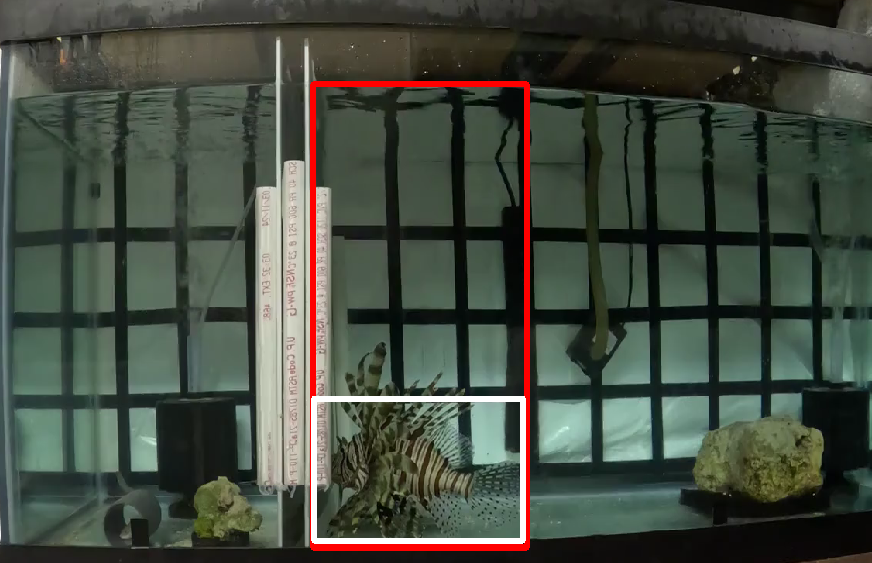
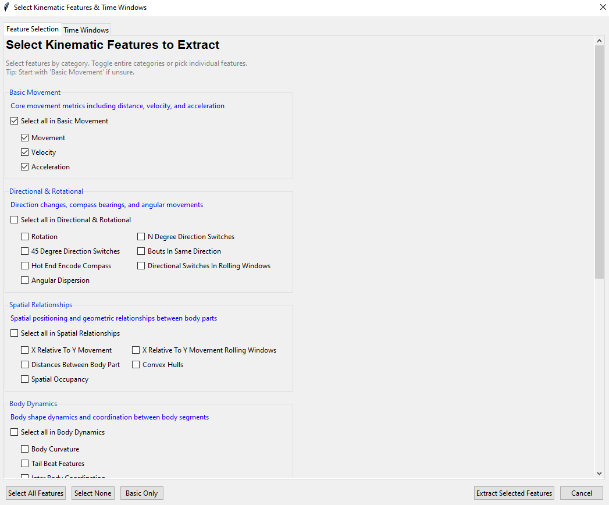
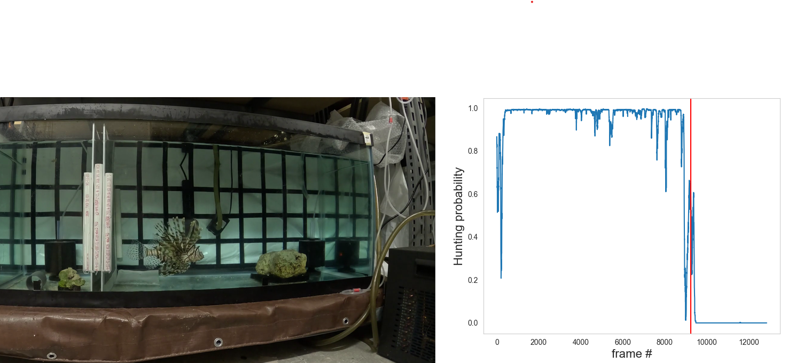

# Lionfish Behaviour Classification (SimBA Demo)

This demo assumes you’re already comfortable with SimBA’s standard flow. We focus on a **fish-tailored** workflow for classifying **Hunting** in lionfish using provided DeepLabCut pose CSVs (no pose re-estimation needed).

---

## 1) Create a SimBA project
Create a new SimBA project, add the **two training videos** from `Training_video/` (with their DLC CSVs), and configure your **body-parts** to match the landmarks below.

**Landmark layout**  

---

## 2) Smooth & correct the pose
Apply to all imported pose CSVs:
- **Smoothing:** Gaussian, **10 s** window  
- **Outlier correction:** Movement criterion **2**, Location criterion **1**

**After smoothing + outlier correction (example):**  

---

## 3) Define ROIs for Hunting
Hunting occurs mostly **near the tank bottom** and **near the divider**. Create two ROIs (name suggestions):
- `bottom_near`
- `near_divider`

**ROI layout (example):**  

---

## 4) Extract fish-specific features
Run the custom extractor:  
[`FishFeatureExtractor_3.1.py`](../Lionfish_feature_extraction_code/FishFeatureExtractor_3.1.py)

Start simple with **Basic Movements** only (good baseline, fast).  
Refer to the **feature catalog** for what each feature means: [`../feature-catalog/`](../feature-catalog/)

**Feature selection dialog (example):**  

**Defined behaviours sheet (reference):**  

---

## 5) Label behaviours & train the model
- Use the **Behaviour Guide** to label **Hunting** on the training videos: [`../Behaviour_guide/`](../Behaviour_guide/)  
- Train your classifier using [these settings](Hunting_demo/Images_Gifs/Hunting_0_meta.csv).

---

## 6) Evaluate on an unseen video
- make another project with the **test** video from [`Testing_videos/`](Testing_videos/)  
- Run the trained model on it  
- Inspect results with **Interactive Probability Plot** in SimBA

**Example probability plots (Hunting):**  
  

> In this demo, **Hunting** is detected using **Basic Movement** features derived from pose. Statistical measurements of your classifier will be available in your models folder 

---
